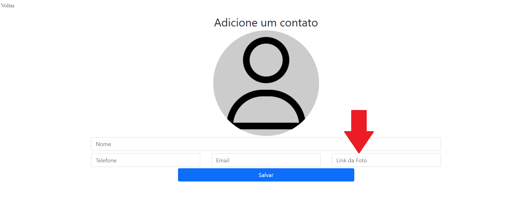

# Qula foi o Desafio?

<ol>
        <li>[x] -Faça uma agenda telefônica (em formato de lista); </li>
        <li>[x] -Na tela de contato deve conter campos de telefone, nome, email e imagem; </li>
        <li>[x] -DEVE ser possível cadastrar, atualizar, visualizar e apagar contatos da agenda; </li>
        <li>[x] -A aplicação DEVE ser feita em React, back em Node e Banco dados em SQL. </li>

</ol>

# Indeia inicial.

Era criar uma sistema de que fosse possivel...
<ol>
<li>[x] Cadastra 

Obs:. A idei inicial era fazer o upload da imgem e armazenar ela no cloudinary e armazena apenas o link da imgem que estaria neste servidor. Porém, não foi possivel devido um problema na requisição com a api do cloudinary que não devolvia o link da imgem no servidor, como não houve tempo para resolução deste probelma, a questão da imgem está sendo fita pela colocação do link no campo

</li>
<li>[x] Atualizar</li>
<li>[x] Deletar</li>
<li>[x] Ver</li>

</ol>

        